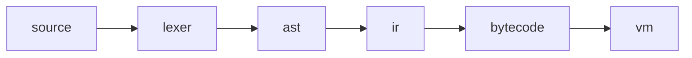

# Spore

An interpretted programming language used for Rust.

## Getting Started

### REPL

The REPL (Read-Evaluate-Print-Loop) can be used to run code and
inspect the virtual machine.

The REPL can be started by running:

```shell
cargo run --example spore
```

Expressions can be evaluated interactively.

```shell
>> (+ 1 2)
$1 = 3
```

#### Commands

Commands can be used to provide more meta functionality. For example, the bytecode for the expression `(+ 1 2)`
can be examined:

```shell
>> ,bytecode (+ 1 2)
  01 - get value for %virtual%/repl/+
  02 - push value 1
  03 - push value 2
  04 - evaluate last 3
```

| Command   | Description                                        | Output                                                            |
|-----------|----------------------------------------------------|-------------------------------------------------------------------|
|           | Evaluate an expression.                            | `3`                                                               |
| ,tokens   | Parsed tokens for the expression(s).               | `Token { item LeftParen ...`                                      |
| ,ast      | Ast for the expression(s).                         | `<identifier +>`<br>`  <int 1>`<br>`  <int 2>`                    |
| ,ir       | Intermediate representation for the expression(s). | `CodeBlock {`<br>`  name: ...`                                    |
| ,bytecode | Bytecode for the expression(s)                     | `  01 - get value for %virtual%/repl/+`<br>`02 - push value 1...` |
| ,trace    | Trace the input and output of all function calls.  | `(<proc repl-proc-1>) => 3`                                       |
| ,help     | Show the help documentation.                       | `Commands`<br>`...`                                               |


## FAQ


**Q: Is this usable?**

> No, this is a toy project.

**Q: Why all the parentheses?**

> Spore is a Lisp which means it uses parentheses. While the syntax
> may not be elegant, it is simple to understand. The simple syntax
> also allows me to focus more on the VM.

## Design



Spore uses a bytecode interpretter to execute code.

- source - The source code string.
- lexer - The lexer parses a string into open/close parensheses, identifiers, numbers and strings.
- ast - An AST is built. Each set of parentheses forms a sub tree in the AST.
- ir - The intermediate representation. It is used to implement some
    desugaring and provides a typed enum to improve readablity.
- bytecode - A sequence of instructions to execute.
- vm - The Spore virtual machine. It evaluates bytecode.
