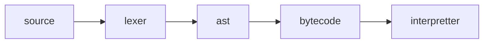

# Spore

An interpretted programming language used for Rust.

## Getting Started

### REPL

The REPL (Read-Evaluate-Print-Loop) can be used to run code and
inspect the virtual machine.

The REPL can be started by running:

```shell
cargo run --example spore
```

| Command      | Example             | Output                                                   |
|--------------|---------------------|----------------------------------------------------------|
|              | `(+ 1 2)`           | `3`                                                      |
| `,ast `      | `,ast (+ 1 2)`      | `Tree([Leaf(Token{ ...`                                  |
| `,bytecode ` | `,bytecode (+ 1 2)` | `01 - push value <proc +>`<br>`02 - push value 1`<br>... |


## FAQ


**Q: Is this usable?**

> No, this is a toy project.

**Q: Why all the parentheses?**

> Spore is a Lisp which means it uses parentheses. While they may not
> be elegant, they are simple to use. The simple syntax also allows me
> to focus more on the VM.

## Design



Spore uses a bytecode interpretter to execute code.

- source - The source code string.
- lexer - The lexer parses a string into open/close parensheses, identifiers, numbers and strings.
- ast - An AST is built. Each set of parentheses forms a sub tree in the AST.
- bytecode - A sequence of instructions to execute.
